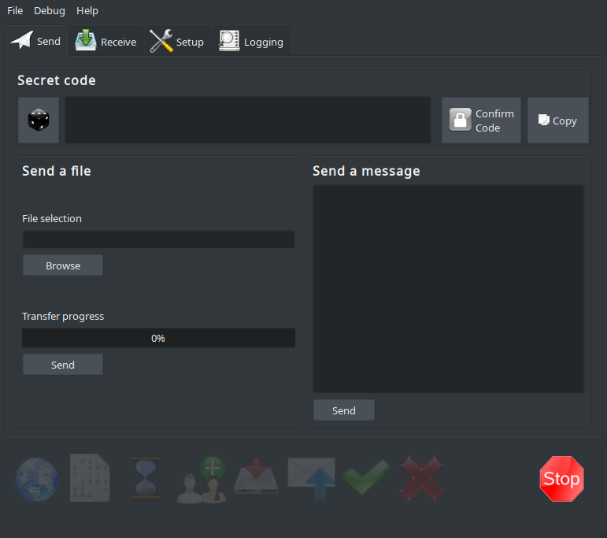

# WormholeGui
Unofficial graphical frontend for the "magic-wormhole" file transfer utility

## Installation
```
pip install -r requirements.txt
```

## Usage

Linux and Mac users may run the command:
```
python main.py
```

Win32 portable binaries are available in the "Releases" section

## Screenshots


